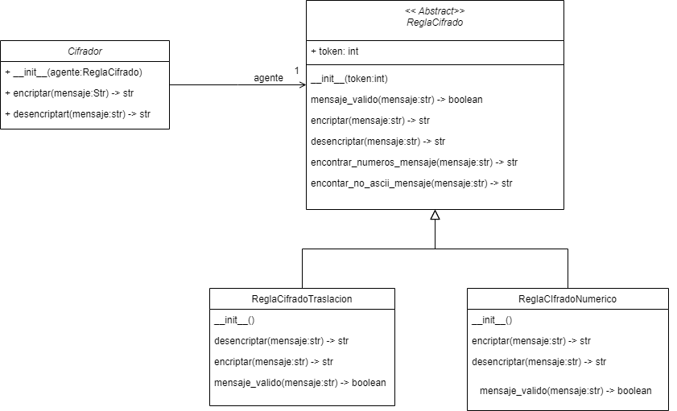
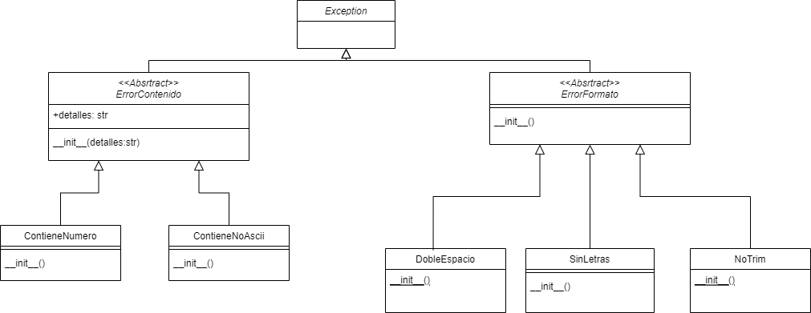

# Ejercicio Cifrador de mensajes

Es interceptado por la CIA para ayudar a mejorar la comunicación secreta entre los entes gubernamentales.

Como prueba inicial para validar si eres lo suficientemente habil para participar en el proyecto más grande de seguridad nacional, debes implementar el diseño de un componente que cifra y descifra mensajes, se establecieron dos reglas de cifrado, 
las cuales fueron nombradas como Cifrado por traslación y Cifrado numerico.

### 1. Cifrado por traslación

Esta regla de cifrado tiene las siguientes restricciones:

* El mensaje que se cifra no puede contener numeros.
* El mensaje debe consistir solamente de letras del alfabeto a-z del codigo ascii y caracteres especiales.
* El mensaje tiene permitido tener espacios, pero no puede ser el unico caracter.
* Antes de realizar el cifrado todo el mensaje debe ser llevado a minuscula.
* El mensaje no puede consistir únicamente de caracteres especiales los cuales son: `@`, `_`, `#`, `$` o `%`

Este cifrado consiste en que con un token dado, se debe cambiar cada letra, por la letra que se encuentra a n saltos de esa posicion en el alfabeto (a-z), con n = token, se considera al alfabeto como una estructura circular, y de z debe seguir a y volver a empezar, cualquier otro caracter que no pertenezca al alfabeto, queda igual.

Descifrar consiste en realizar el paso contrario, tomar cada letra y moverse hacia atrás n= token pasos para encontrar cuál era la letra original.
### 2. Cifrado numerico

Esta regla de cifrado tiene las siguientes restricciones:

* El mensaje que se cifra no puede contener numeros.
*  El mensaje tiene permitido tener espacios, pero maximo 1 entre cada letra y no puede haber espacios al inicio o al final.
* Antes de realizar el cifrado todo el mensaje debe ser llevado a minuscula.

Este cifrado consiste en, por cada caracter en el mensaje se tomara su valor numerico y se multiplica por el valor del token y se guardara en un string, dejando un espacio por cada uno.

Descifrar será simplemente, obtener los caracteres correspondientes, a cada valor numerico debera primero dividirlo por el valor del token posteriormente obtener de regreso el caracter y volver a formar el mensaje.

 Se aconseja utilizar el metodo ord() para obtener el valor numerico de cada caracter y el constructor de chr() para obtener el caracter correspondiente a cada valor numerico.

El arquitecto de software de la CIA realizó el siguiente diseño para que puedas implementar el modelo del componente de cifrado:

Tu misión es implementar el modelo planteado por el arquitecto de software. Para lograr tu misión 
debes tener en cuenta lo siguiente:

* La clase `ReglaCifrado` es una clase abstracta y sus métodos `encriptar`, `desencriptar` y `mensaje_valido` son igualmente abstractos.
* La clase `ReglaCifrado` recibe en su constructor, un valor numerico que será asignado a una variable de instancia llamada token.
* El método `encontrar_numeros_mensaje` de la clase `ReglaCifrado` implementa la lógica para regresar una lista con las posiciones donde se encuentre un número en un mensaje que entra como parametro. 
* El método `encontrar_no_ascii_mensaje` de la clase `ReglaCifrado` implementa la lógica para regresar una lista con las posiciones donde se encuentre un caracter que no pertenezca al código ascii, se usara para encontrar letras con acentos, en un mensaje que entra como parametro. 
* Las clases `ReglaCifradoTraslacion` y `ReglaCifradoNumerico` tienen un método `mensaje_valido` donde se debe 
implementar la lógica para verificar si el mensaje ingresado cumple con las restricciones en la descripción superior de cada clase, en caso de que no se cumpla alguna de las restricciones, debe levantarse un error de acuerdo a la siguiente jerarquía de errores:

* Tenga en cuenta, que si el error es por contenido, o sea, el mensaje tiene numeros o caracteres no permitidos porque no están en el codigo ascii (por ejemplo al llevar acentos), debera incluir en el constructor un mensaje donde detalle en cuál posición se encuentra los caracteres que causan el error y cuál es el caracter en específico por orden de aparición.
* Si existe más de un tipo de error en un mensaje, levantar un grupo de errores con cada error que se deberia levantar para mas informacion si es requerido visite https://docs.python.org/es/3/tutorial/errors.html
* De ser necesario, puede agregar metodos en la clase que lo requiera para facilitar el desarrollo de la actividad, se sugiere que por cada metodo que agrega, realice al menos una prueba unitaria que verifique que el metodo funciona correctamente. 
* Los métodos `encriptar` y `desencriptar` en las clases `ReglaCifradoTraslacion` y `ReglaCifradoNumerico`
son las implementaciones de los métodos abstractos de la clase padre. En estos métodos debes implementar 
la logica correspondiente utilizando la descripción dada al inicio sobre cada regla de cifrado, tenga en cuenta que antes de realizar la encriptacion en cualquiera de las clases, lo primero es verificar si el mensaje es válido y luego llevar todo el mensaje a minuscula.
* Los metodos `encriptar` y `desencriptar`  de la clase `Cifrador` debe retornar el resultado de invocar el metodo correspondientes en el objeto `agente` que tiene como atributo.
# BONUS
* Cree un archivo con la extension que desee, se sugiere que sea Json, donde tenga una lista de mensajes diferentes, que pasen y no pasen las restricciones del modelo de cifrado.
* En main, implementar un cifrador con la regla numerica y otro cifrador con la regla por traslación, el valor del token es cualquier número de su elección.
*En main cree una funcion que lee el archivo creado y por cada mensaje, en ambos cifradores, imprima en pantalla, el mensaje cuando lo encripta, guarde el valor cifrado e imprima el resultado luego de desencriptar el mensaje, recuerde manejar los errores que se levantan en el modelo.
# IMPORTANTE
Para realizar la actividad puedes clonar este repositorio e implementar el código en el archivo 
`cifrador.py` que se encuentra en el paquete `cifradorMensajes.modelo`.

Una vez clones el repositorio, debes crear y activar el ambiente virtual. Si sabes como hacerlo en PyCharm o VSCode, hazlo. Si no, ejecuta los siguientes comandos en la consola de Windows:

* `python -m venv venv`
* `venv/Scripts/activate`
* `pip install -r requirements.txt`

Si te sale un mensaje de error diciendo que no tienes permisos para ejecutar scripts, ejecuta el siguiente comando:

* `Set-ExecutionPolicy -ExecutionPolicy RemoteSigned -Scope CurrentUser`

## Tenga en cuenta

* El proyecto incluye un conjunto de pruebas que puedes utilizar para verificar el cumplimiento de los 
requisitos establecidos. Para ejecutar las pruebas, debes instalar la dependencia pytest.
* Para que las pruebas funcionen adecuadamente debes implementar el código respetando los nombres y la 
definición de las clases y los métodos que se presentan en el diagrama.
* La evaluación del ejercicio se hará con base en el cumplimiento de los requisitos que arrojen las 
pruebas. Por lo tanto, cualquier fallo en las pruebas debido a nombres mal escritos o que no concuerden
con el modelo dado se considerará como un requisito no cumplido, afectando la calificación del examen.